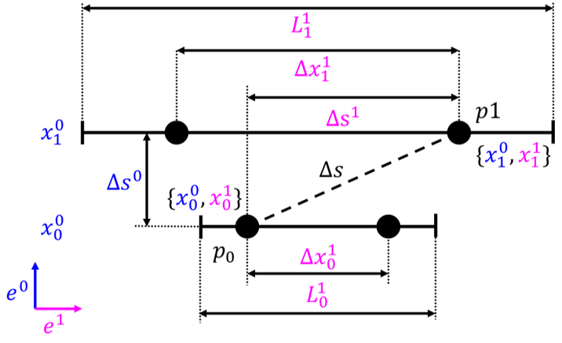
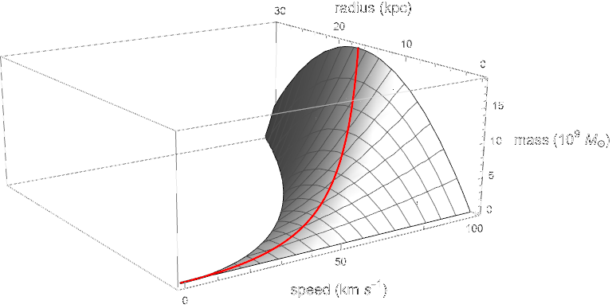
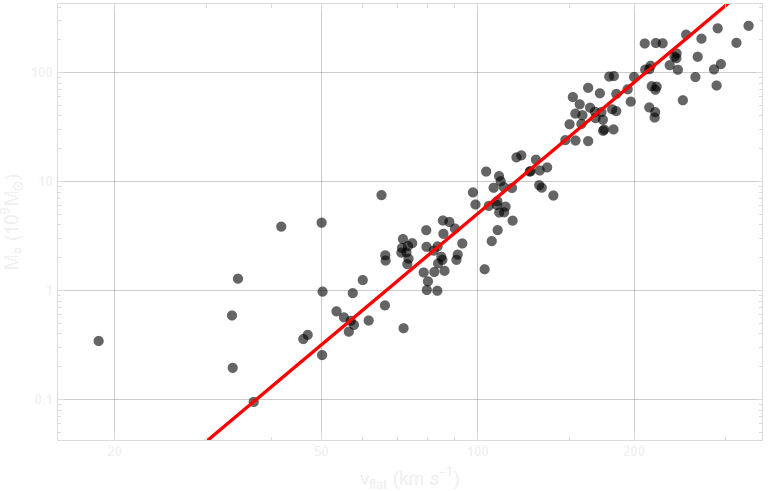
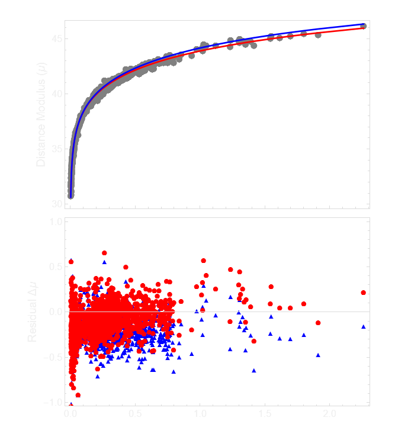
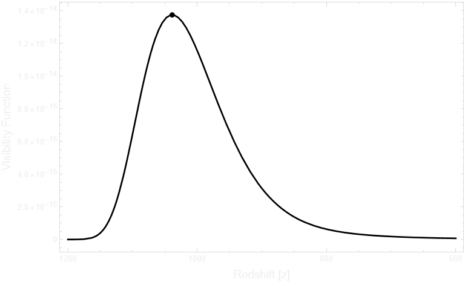

<h1 align="center">Gravity and Action from the Evolution of a Complex Manifold</h1>

  

  <strong>Parabolic Metric Evolution (PME)</strong> &mdash; an alternative cosmological framework
  that derives gravity, the Hubble constant, and galaxy rotation curves from a single acceleration scale,
  without invoking dark matter or dark energy.

<h2>Overview</h2>

This repository accompanies the paper <em>Gravity and Action from the Evolution of a Complex Manifold</em>,
which develops the Parabolic Metric Evolution (PME) framework as an alternative to standard FLRW cosmology.
PME addresses the Hubble tension, galaxy rotation curves, and the baryonic Tully&ndash;Fisher relation
through a single geometric construction grounded in a complex manifold with a constant acceleration scale.
The framework reproduces key cosmological and galactic observations without introducing dark matter,
dark energy, or any independent dynamical components.

<h3>Highlights</h3>

<ul>
  <li>Fits the Pantheon+ Type Ia supernova distances on the SH0ES-calibrated absolute scale with substantially lower covariance-weighted &chi;2 than Planck-calibrated FLRW.</li>
  <li>Predicts the present-day Hubble constant <em>H0</em> = 66.5 km s&minus;1 Mpc&minus;1 as a derived quantity rather than a fitted parameter.</li>
  <li>Reproduces the baryonic Tully&ndash;Fisher relation from the SPARC galaxy sample using the same acceleration scale <em>A</em> = 3.7&times;10&minus;11 m s&minus;2.</li>
  <li>Yields a CMB acoustic angular scale 100&theta;* = 1.03, consistent with Planck measurements.</li>
  <li>Produces uniformly extended cosmic ages, easing tension with early massive-galaxy observations.</li>
</ul>

<h3>Repository Contents</h3>

<ul>
  <li><code>Gravity and Action from the Evolution of a Complex Manifold.pdf</code> &mdash; full manuscript.</li>
  <li><code>figures/</code> &mdash; figures referenced in the manuscript and this README (manifold schematic, BTFR plot, Hubble diagram, visibility function, fundamental plane).</li>
  <li><code>notebooks/</code> &mdash; Wolfram Language notebooks reproducing the bilocal geometry, distance&ndash;redshift relation, BTFR fit to SPARC data, and Pantheon+ comparison.</li>
  <li><code>CITATION.cff</code> &mdash; structured citation metadata.</li>
  <li><code>LICENSE</code> &mdash; GPL-3.0 license.</li>
</ul>

<h2>Abstract</h2>

We present a bilocal geometric framework in which separations are defined between ordered pairs of events rather than by a local infinitesimal metric. This construction is motivated by the need to represent global evolution in a manner that remains well-defined over finite separations while admitting a smooth local limit.

The resulting geometry is formulated on a complex manifold with an imaginary temporal coordinate and a real spatial coordinate. A constant manifold acceleration sets the global spatial scale and produces a parabolic cycle of expansion and contraction.

In the local reduction, the same acceleration scale yields a circular-orbit envelope consistent with the baryonic Tully–Fisher relation. At cosmological scales, the resulting analytic distance–redshift relation predicts the Pantheon+ Type Ia supernova luminosity distances on the SH0ES-calibrated absolute scale and yields a lower covariance-weighted $\chi^2$ than Planck-calibrated FLRW, without invoking dark matter or dark energy.

The parabolic metric evolution, when combined with standard recombination microphysics, yields an acoustic angular scale consistent with Planck measurements.

  

  <em>
    Figure 1 - Schematic representation of the complex parabolic metric manifold.
    Latitude lines correspond to spatial slices at fixed epoch,
    while longitude lines trace the temporal evolution of the manifold.
  </em>

<h2>Introduction</h2>

Cosmological observations tightly constrain theoretical descriptions of the universe. Measurements of the cosmic microwave background (CMB) fix early-universe conditions and global geometry with high precision, while Type Ia supernovae (SNe Ia) probe the late-time expansion history through the luminosity distance–redshift relation. Although each dataset is internally consistent, discrepancies arise when parameters inferred from early- and late-time observations are compared. In particular, the tension in the Hubble constant indicates that the standard cosmological model may be incomplete.

Historically, such discrepancies have been addressed by extending the model. The cosmological constant was introduced to permit a static universe and abandoned following the discovery of expansion. Galaxy rotation curves motivated the introduction of non-baryonic dark matter, and supernova evidence for accelerated expansion led to the reintroduction of the cosmological constant as dark energy. While these additions yield a phenomenologically successful framework, the dominant components of the cosmic energy budget remain physically unexplained. More recent approaches introduce additional degrees of freedom, including time-varying dark energy, further increasing the parametric structure of the model.

We develop a kinematic framework in which large-scale evolution and local gravitational phenomena arise from a common geometric structure, termed the Parabolic Metric Evolution (PME). Local metric descriptions specify infinitesimal separations, so finite separations between distant events must be constructed by integrating along a chosen connection; in a globally evolving system, this construction can depend on both the path and the evolution of the geometry. The PME framework replaces this path-dependent procedure with a bilocal definition that assigns separations directly to ordered event pairs while admitting a consistent local limit. Motion on the manifold is governed by a single intrinsic kinematic scale, eliminating the need for multiple independent cosmological parameters and linking global expansion and local dynamics to a common geometric origin.

This approach differs from relativistic metric gravity in its bilocal definition of separation and from modified-gravity models in that the characteristic acceleration scale is not introduced phenomenologically but inherited from the global manifold kinematics by the local-reduction regime. Cosmological evolution, gravity, and the laws governing motion are thereby unified through a single acceleration scale determined by the manifold kinematics.

The resulting construction defines a minimal kinematic closure: the lowest-order geometric structure that consistently relates finite separations, global evolution, and local dynamics within a single framework, without introducing independent dynamical components. The bilocal definition of separation provides a representation of finite intervals compatible with global evolution, and the restriction to a single intrinsic acceleration scale selects the simplest nontrivial homogeneous dynamics beyond uniform motion, yielding a closed and self-consistent description across cosmological and local regimes.

<h2>Bilocal Geometry</h2>

<h3>Foundational Structure</h3>

The framework is defined by the following postulates:

<ol>
  <li>Physical separations are defined bilocally between ordered pairs of events.</li>
  <li>The manifold evolution is governed by a constant acceleration scale $A$.</li>
  <li>The manifold is parameterized by an intrinsic evolution coordinate $\chi$.</li>
  <li>Observable time is defined operationally through null exchange, providing an invariant ordering of events. The intrinsic evolution parameter is related to this observable time by the projection $\chi = it$, which fixes the real–imaginary decomposition of temporal and spatial functionals and serves as a defining structural postulate of the framework.</li>
</ol>

All subsequent results follow from this structure.

<h3>Bilocal Spatial Separation</h3>

Let $p_e=(x_e^0,x_e^1)$ denote an emission event and $p_o=(x_o^0,x_o^1)$ an observation event, with the bilocal interval constructed from a temporal functional obtained from accumulated evolution between slices and a spatial functional defined from separations on the emission and observation slices.

The spatial slices scale with a global manifold extent $L(t)$, so the separations at emission and observation satisfy

$$\frac{\Delta x_e^1}{L(t_e)}=\frac{\Delta x_o^1}{L(t_o)}$$

Imposing symmetry under interchange of emission and observation together with a smooth coincidence limit motivates adopting the midpoint average as the minimal symmetric choice,

$$\Delta s^1=\Delta x_o^1-\frac12(\Delta x_o^1-\Delta x_e^1)$$

$$\Delta s^1=\frac12(\Delta x_o^1+\Delta x_e^1)$$

  

Geometric construction of the bilocal interval between emission event $p_e$ and observation event $p_o$, showing the accumulated temporal evolution and the symmetric midpoint spatial separation between scaled slices.

<h3>Invariance of the Bilocal Interval</h3>

Consider a bilocal scalar constructed from the temporal and spatial endpoint functionals $(\Delta s^0,\Delta s^1)$. We adopt a quadratic form as the lowest-order scalar consistent with finite separations, ensuring that the local reduction yields a well-defined null condition while avoiding higher-order dependence on endpoint structure,

$$\Delta s^2 = a\,(\Delta s^0)^2 + b\,(\Delta s^1)^2 + 2c\,\Delta s^0 \Delta s^1$$

Under interchange of the ordered endpoints $(p_e,p_o)$, the temporal functional changes sign while the symmetric spatial functional does not, so the mixed term changes sign. Invariance therefore requires $c=0$.

In the local reduction, sufficiently small endpoint separations render the temporal and spatial functionals linear in the coordinate increments. The null condition must define a finite null ratio, which requires both temporal and spatial contributions to enter non-degenerately so that the null condition defines a finite null ratio. The interval therefore reduces to

$$\Delta s^2 = a\,(\Delta s^0)^2 + b\,(\Delta s^1)^2$$

The remaining quadratic form is constrained up to a positive overall factor and a relative scaling between the temporal and spatial functionals. These functionals are identified with the canonical imaginary and real components of the complex manifold, with this identification fixing their relative normalization. The bilocal interval is therefore

$$\Delta s^2 = (\Delta s^0)^2 + (\Delta s^1)^2$$

with $\Delta s^0$ purely imaginary and $\Delta s^1$ real.

<h3>Imaginary Velocity</h3>

The intrinsic evolution of the manifold is parameterized by a coordinate $\chi$. Observable time is introduced by the projection $\chi = it$, so that $d\chi = i\,dt$, fixing the real–imaginary decomposition used in the bilocal construction.

With constant intrinsic acceleration $A$, the velocity scale along the manifold history follows from integration with respect to $\chi$,

$$v(t) = \int A\, d\chi$$

Substituting $d\chi = i\,dt$ gives $v(t) = i\!\int A\,dt$, which evaluates to

$$v(t) = i(At - V_0)$$

where $V_0$ is an integration constant representing the initial expansion rate of the manifold.

<h3>Induced Spatial Evolution</h3>

The observable spatial extent arises from integrating the imaginary velocity along the imaginary temporal direction. The global spatial scale of the manifold is therefore $L(t) \equiv \int v(t)\, d\chi$. Substituting the expression for $v(t)$ and using $d\chi = i\,dt$ gives $L(t) = \int i(At - V_0)\, i\, dt$. Evaluating the integral yields

$$L(t) = V_0 t - \frac{1}{2} A t^2$$

<h3>Manifold Deceleration</h3>

The intrinsic evolution is defined along $\chi$, while observable dynamics are expressed in the projected time coordinate $t$ with $d\chi = i\,dt$. Rewriting the manifold extent in terms of $t$ yields its observable form. Differentiating twice with respect to $t$ gives

$$\frac{d^2 L}{dt^2} = -A$$

so the manifold extent evolves with a constant kinematic deceleration of magnitude $A$, which is universal and independent of position or epoch.

<h2>Cosmological Distance</h2>

Observable cosmological distances follow from the bilocal interval defined above.

<h3>Temporal Separation</h3>

The temporal component of the bilocal interval is obtained from the accumulated tangent evolution along the manifold history between the emission and observation parameters $t_e$ and $t_o$, $\Delta s^0 \equiv \int_{t_e}^{t_o} v(t)\,dt$. Substituting the imaginary velocity gives

$$\Delta s^0 = \int_{t_e}^{t_o} i\left(A t - V_0\right)\,dt$$

Evaluating the integral yields

$$\Delta s^0 = i\left(\frac{A}{2}\left(t_o^2 - t_e^2\right) - V_0\left(t_o - t_e\right)\right)$$

The temporal separation is purely imaginary and depends only on the endpoints.

<h3>Spatial Separation</h3>

Because spatial slices scale with the manifold extent $L(t)$ and the slice separations satisfy the bilocal scaling relation, the spatial component becomes

$$\Delta s^1 =\frac{\Delta x_o^1}{2}\left(1 +\frac{V_0 t_e - \frac{1}{2} A t_e^2}{V_0 t_o - \frac{1}{2} A t_o^2}\right)$$

<h3>Bilocal Metric Formula</h3>

Substituting the temporal and spatial separations into the bilocal interval yields the interval relating the emission and observation events,

$$\Delta s^2 = \left[i\left(\frac{A}{2}\left(t_o^2 - t_e^2\right) - V_0\left(t_o - t_e\right)\right)\right]^2+ \left[\frac{\Delta x_o^1}{2}\left(1 + \frac{V_0 t_e - \frac{1}{2}A t_e^2}{V_0 t_o - \frac{1}{2}A t_o^2}\right)\right]^2$$

<h3>Redshift Relation</h3>

Redshift is defined observationally by the ratio of observed to emitted wavelength,

$$1+z \equiv \frac{\lambda_o}{\lambda_e}$$

We identify wavelength with a comoving spatial separation and assume that such separations scale with the manifold extent, so that $\lambda(t) \propto L(t)$,

$$1+z = \frac{L(t_o)}{L(t_e)}$$

Using the manifold extent, the emission epoch $t_e$ is expressed in terms of $t_o$ and the observed redshift $z$,

$$t_e = \frac{V_0(1+z) - \sqrt{(1+z)\big[(V_0 - A t_o)^2 + V_0^2 z\big]}}{A(1+z)}$$

where the negative branch is chosen so that $t_e < t_o$. Substituting into the bilocal metric and imposing the null condition $\Delta s^2 = 0$ yields the observable spatial separation,

$$D_C(z)= \frac{t_o\left(2V_0 - A t_o\right) z}{2 + z}$$

<h2>Causal Structure</h2>

The null structure of the bilocal interval also determines the extent of causal connectivity on the manifold. The largest spatial separation permitted by null ordering is obtained with the emission event at the origin of the manifold history, $t_e = 0$, and the observation event at epoch $t_o = t$. Solving the null condition $\Delta s^2 = 0$ for the observed separation gives the causal horizon

$$d_{\mathrm{ch}}(t) = t\left(2V_0 - A t\right)$$

Differentiating the causal horizon gives the expansion rate of the causal boundary,

$$c_{\mathrm{c}}(t)=\frac{d}{dt}\,d_{\mathrm{ch}}=2\left(V_0-At\right)$$

This quantity defines the rate at which the accessible causal domain can be extended under the operational clock, and therefore characterizes the growth of the causally orderable region.

Comparing the causal horizon with the manifold extent $L(t)$ yields

$$\frac{d_{\mathrm{ch}}(t)}{L(t)} = 2$$

The causal horizon is therefore twice the manifold extent at all epochs, placing the entire last-scattering surface within a single causal region. Because the homogeneous manifold acceleration introduces no preferred direction, the large-scale isotropy of the cosmic microwave background follows directly from the geometry.

<h2>Gravity</h2>

When the temporal interval between neighboring events is small compared with the characteristic evolution scale of the manifold extent $L(t)$, the bilocal construction admits a smooth local reduction yielding an effective acceleration field inherited from the manifold kinematics.

<h3>Coincidence Limit</h3>

The local description is obtained as the coincidence limit of the bilocal interval as the endpoint separation tends to zero. Let the observation event occur at epoch $t$ and the emission event at $t-\Delta t$, with $\Delta t \to 0$. Using the local expansion of the manifold extent,

$$L(t-\Delta t)=L(t)-\dot L(t)\,\Delta t-\frac{1}{2}A\,\Delta t^2$$

the bilocal spatial component reduces to leading order in $\Delta t$ as $\Delta s^1 \approx \Delta x_o^1$, and the temporal component becomes

$$\Delta s^0 \approx i\left(V_0-At\right)\Delta t$$

Substituting these leading terms into the bilocal interval yields the emergent local interval,

$$\Delta s^2 \approx -\left(V_0-At\right)^2\Delta t^2 + (\Delta x_o^1)^2$$

The local interval therefore defines a tangent of fixed magnitude $V_0-At$ shared by all trajectories at epoch $t$, whose projections onto orthogonal temporal and spatial components give rise to timelike, null, and spacelike directions.

<h3>Acceleration Field</h3>

Expanding the manifold extent about a reference epoch $t_0$ gives

$$L(t_0+\delta t)=L(t_0)+\dot{L}(t_0)\,\delta t+\frac{1}{2}\ddot{L}(t_0)\,\delta t^2+\cdots$$

The quadratic term is governed by the constant local value $\ddot{L}(t_0)=-A$. The local reduction therefore contains a homogeneous second-order contribution corresponding to a uniform deceleration of magnitude $A$ inherited from the global manifold evolution, which provides the physical origin of gravity in the local limit. This uniform deceleration defines the background acceleration field underlying local gravitational dynamics.

The effective inward acceleration in a bound system decomposes into a homogeneous background and a sourced concentration,

$$a_{\mathrm{in}}(x)=a_{\mathrm{bg}}+a_{\mathrm{conc}}(x)$$

The background term $a_{\mathrm{bg}}$ is uniform and has constant magnitude $A$. In the absence of localized content, it defines the manifold evolution, and an inertial frame follows it without inducing concentration or depletion. Localized inertial content, however, resists this acceleration, redistributing the flux into spatial concentrations that define the sourced gravitational component $a_{\mathrm{conc}}(x)$ governing bound dynamics. The inertial parameter $m$ entering this redistribution is the same quantity that weights the invariant separation in the construction of geometric action, so that the gravitational response corresponds to a redistribution of the inertia-weighted action-space separation underlying the local geometry.

<h3>Minimal Local Closure</h3>

The bilocal construction fixes the homogeneous background acceleration scale $A$ through the second-order local reduction of the manifold extent but does not determine the sourced concentration arising from spatial variations in inertial resistance. A weak-field closure is therefore required.

We adopt a minimal closure as the lowest-order local form consistent with locality, linearity in enclosed inertial content, rotational invariance, and additivity. These conditions restrict the sourced field to a divergence relation as the leading-order connection between field structure and inertial content, rather than an assumed inverse-square form. The concentration field therefore satisfies a divergence proportional to a local inertial density, with enclosed content given by its volume integral. In the weak-field limit, this density is dominated by rest mass and reduces to the baryonic density. All intrinsic kinematic scales are fixed by the acceleration scale $A$, while the constant $G$ sets the coupling to localized inertial content without introducing an additional kinematic scale.

For a spherically symmetric configuration the flux through a sphere of radius $r$ is

$$\Phi(r)=\oint_S \mathbf a_{\mathrm{conc}}\cdot d\mathbf S=4\pi r^2 a_r(r)$$

Imposing flux conservation together with linearity in the enclosed inertial content gives

$$\oint_S \mathbf a_{\mathrm{conc}}\cdot d\mathbf S = -4\pi G M(r)$$

where $M(r)$ is the enclosed inertial content within radius $r$, obtained from the local density by $M(r)=\int_V \rho_{\mathrm{inertial}}\,dV$, and $G$ is the empirical coupling relating inertial content to concentration of the background acceleration. Spherical symmetry then yields

$$\mathbf a_{\mathrm{conc}}(r)=-\frac{G M(r)}{r^2}\,\hat r$$

and Gauss's theorem gives the Poisson equation for the sourced weak-field limit,

$$\nabla\!\cdot \mathbf{a}_{\mathrm{conc}} = -4\pi G \rho_{\mathrm{inertial}}$$

In the weak-field regime relevant for galactic dynamics, the inertial density is dominated by baryonic rest-mass contributions, so $\rho_{\mathrm{inertial}}\approx\rho_b$.

<h3>Circular Orbits</h3>

For a body in a circular orbit of radius $r$ with tangential speed $v$, the required centripetal acceleration is $a_{\mathrm{cent}}(r) = -v^2/r$. Equating this with the inward acceleration from the decomposition above and multiplying by $r$ gives $v^2 = A r + G M_b(r)/r$. Solving for the enclosed baryonic mass gives

$$M_b(r) = \frac{r\left(v^2 - A r\right)}{G}$$

<h3>Circular-Orbit Solutions</h3>

The equation above defines the PME fundamental plane, a two-parameter family of circular-orbit solutions relating baryonic mass $M$, orbital radius $r$, and orbital speed $v$. For fixed orbital speed $v$, the mass function $M(r)$ is a concave quadratic in $r$. The mass therefore reaches a maximum at

$$r_{\max} = \frac{v^2}{2A}$$

Substituting this radius into the mass–radius relation yields the maximum baryonic mass compatible with a circular orbit at speed $v$,

$$M_{\max}(v) = \frac{v^4}{4 A G}$$

The surface $M(v,r)$ therefore defines a fundamental plane of circular-orbit solutions, with the ridge $M_{\max}(v)$ giving the upper envelope of baryonic mass for a given orbital speed. Galaxies dominated by circular rotation are expected to saturate this boundary and follow a characteristic mass–velocity relation.

  

  <em>
    PME fundamental plane. The baryonic mass surface $M(v,r)$ is shown as a function of orbital speed $v$ and
    orbital radius $r$ for an illustrative manifold acceleration scale $A = 10^{-11}\ \mathrm{m\,s^{-2}}$.
    The red ridge marks the locus $M_{\max}(v)$ corresponding to the maximum baryonic mass permitted by the
    manifold kinematics at each orbital speed. Galaxies populating this ridge reproduce the baryonic
    Tully–Fisher relation.
  </em>

<h3>Baryonic Tully–Fisher Relation</h3>

$M_{\max}(v)$ defines the scaling $M \propto v^4$, consistent with the observed baryonic Tully–Fisher relation. A characteristic acceleration scale in galaxy dynamics has previously been emphasized in frameworks such as MOND, in which the force law is modified to reproduce Tully–Fisher-type scaling.

The manifold acceleration $A$ is determined empirically by fitting the circular-orbit envelope to the SPARC galaxy sample of McGaugh, Lelli and Schombert, using the assumptions $\Upsilon_\star=0.5$, $f_{\mathrm{gas}}=1.33$, zero intrinsic mass-to-light uncertainty, and the quality cut $\mathrm{Qual}\leq 3$. These rotationally supported disk systems are well suited to the analysis, as their kinematics closely follow the circular-orbit approximation.

For each galaxy the rotation curve provides an asymptotic circular velocity $v$, while the baryonic mass $M_b$ is computed as $M_b=\Upsilon_\star L_{3.6}+f_{\mathrm{gas}}\,M_{\mathrm{HI}}$. The value of $A$ is determined by minimizing the $\chi^2$ statistic between the theoretical envelope and the observed $(M_b,v)$ pairs. The best-fit manifold acceleration is

$$A = 3.7\times10^{-11}\ \mathrm{m\,s^{-2}}$$

The observed galaxies follow the predicted $M\propto v^4$ scaling across a wide range of baryonic masses and rotational velocities. The baryonic Tully–Fisher relation is a direct consequence of the constant-acceleration structure of the manifold and an observational signature of the acceleration flux.

  

  <em>
    Log–log plot of baryonic mass $M_b$ versus outer rotation speed $v$ for the SPARC galaxy sample of
    McGaugh, Lelli and Schombert. Black circles show the observed galaxies. The solid red line shows the
    PME circular-orbit envelope evaluated at the best-fit acceleration.
  </em>

<h3>Global Acceleration Budget</h3>

The local closure fixes all non-homogeneous acceleration flux as sourced by inertial content. In the weak-field regime this reduces to baryonic mass. Integrating the flux law over the full homogeneous domain of scale $L$ and using the global relation between baryonic mass and the background acceleration scale,

$$M_b^{\mathrm{tot}}=\frac{A L^2}{G}$$

yields

$$\Phi_{\mathrm{tot}}=-4\pi A L^2$$

The available concentration flux is fixed by the background scale $A$ and is completely accounted for by baryonic mass. Local gravitational systems therefore correspond to partial redistributions of a finite acceleration budget, so gravitational collapse approaches a saturated configuration rather than an unbounded one.

<h3>Mach's Bucket</h3>

The bilocal reduction introduces a homogeneous acceleration scale $A$ fixed by the geometry of the manifold. This acceleration is not sourced by baryonic matter; instead, baryonic mass redistributes it through conservation of acceleration flux.

For a rotating system of radius $r$ and tangential speed $v$, circular motion requires an inward centripetal acceleration $v^{2}/r$. In this framework, that requirement is met by redistributing the background field to produce the necessary inward concentration.

Because the total acceleration is finite, this redistribution cannot be local: any concentration within the system must be balanced globally. Rotational inertia therefore depends on the global distribution of mass through the shared acceleration field, providing a Machian interpretation.

<h3>Regularity of the Manifold</h3>

Because the manifold acceleration scale is finite, collapse approaches saturated configurations of finite density and radius rather than singular limits. The manifold accordingly remains smooth under the evolution defined by the geometry and does not admit singular collapse.

Causal ordering is fixed by the intrinsic geometry of allowable separations, not by any imposed signal speed. Only trajectories consistent with this ordering admit an operational time parameter, excluding closed timelike curves and the associated causal paradoxes. The causal structure and finite acceleration budget thereby avoid singularities and causal paradoxes.

<h2>Local Dynamics</h2>

Having established the gravitational and causal structure, we now define the operational dynamics governing motion within the manifold.

<h3>Operational Time</h3>

Imposing the null condition $\Delta s^2=0$ on the local interval gives

$$(V_0 - At)^2 \Delta t^2=\Delta x^2$$

so that

$$\Delta t=\frac{\Delta x}{(V_0 - At)}$$

This defines the null boundary of the local geometry and fixes the relation between spatial separation and temporal increment through the scale $(V_0 - At)$.

Observable time is defined operationally by null exchange between nearby worldlines. One tick of the clock is a complete round trip of a signal along null trajectories, and the temporal parameter $t$ is identified with the number of such cycles, which defines an invariant ordering of events. The null relation ensures that each cycle corresponds to a temporal increment determined by the local scale $(V_0 - At)$ at that epoch, and restricts admissible trajectories to those consistent with this ordering.

The null relation therefore fixes the local causal structure and operational ordering of events. Observable motion and the invariant timelike interval both arise from this same local geometry, so causality, motion, and measurable duration are unified through the null structure of the manifold.

<h3>Proper Time</h3>

Using the local interval, proper time defines the invariant timelike interval along admissible trajectories, $d\tau^2 \equiv -ds^2$, so that

$$d\tau^2 = (V_0 - At)^2\,dt^2 - dx^2$$

giving

$$d\tau = (V_0 - At)\sqrt{1 - \frac{v^2}{(V_0 - At)^2}}\;dt$$

where $v = dx/dt$.

<h3>Local Momentum</h3>

A non-zero manifold acceleration defines a global acceleration flux that selects a timelike direction. In the homogeneous local limit, the orientation relative to the flux is represented by an angle $\theta$. Resolving the tangent via the local invariant, the orthogonal projections admit a representation yielding

$$dx = (V_0 - At)\sin\theta\,d\lambda,\qquad dt = \cos\theta\,d\lambda$$

The measurable velocity may be expressed as

$$v = \frac{dx}{dt} = (V_0 - At)\tan\theta$$

The null boundary is reached when $v = V_0 - At$, which requires $\tan\theta = 1$ and therefore $\theta = \pi/4$. Observable motion is accordingly restricted to the timelike domain $0 \le \theta < \pi/4$. At this boundary, the underlying geometric structure remains well-defined through the orientation angle $\theta$, but the kinematic description in terms of $t$ ceases to apply. Beyond this limit, the projection geometry persists but no longer corresponds to observable motion; its continuation is defined in terms of phase evolution.

Momentum is defined from the observable velocity,

$$P = m\,v$$

and is the spatial projection of the geometric momentum scale $m(V_0-At)$ with respect to the temporal parameter $t$.

<h3>Local Action</h3>

In the coincidence limit, weighting the invariant separation $ds$ by the tangent momentum scale $P_{\mathrm{geom}} \equiv m(V_0-At)$ defines the invariant geometric action increment $dS_{\mathrm{geom}} \equiv P_{\mathrm{geom}}\,ds$, with quadratic form

$$dS_{\mathrm{geom}}^2 = P_{\mathrm{geom}}^2\,ds^2 = m^2(V_0-At)^2\left[-(V_0-At)^2 dt^2 + dx^2\right]$$

The temporal component defines the geometric energy scale associated with tangent evolution,

$$E_{\mathrm{geom}}(t)\equiv -m(V_0-At)^2$$

while the spatial component is governed by the geometric momentum scale $P_{\mathrm{geom}}=m(V_0-At)$. Evaluating the local interval on the tangent direction gives $ds=(V_0-At)\,d\lambda$, so that

$$dS_{\mathrm{geom}} = m(V_0-At)^2\,d\lambda$$

and the invariant geometric action accumulates along the manifold tangent as $S_{\mathrm{geom}} = \int dS_{\mathrm{geom}}$.

Observable action is obtained by projection into the timelike sector,

$$dS = P\,dx - H\,dt$$

which defines the canonical momentum and observable Hamiltonian. The observable action therefore plays the role of the Hamilton–Jacobi principal function, while the invariant geometric action remains well-defined across the full manifold.

<h3>Phase Evolution</h3>

The projection-based kinematic description applies within the timelike sector, where the local invariant defines a real proper-time interval. At the null boundary, $ds^2=0$ and $d\tau \to 0$, marking the limit of observable timelike motion. Beyond this boundary, observable motion ceases, while the invariant geometric structure remains well-defined and the geometric action continues to accumulate along the manifold tangent.

The continued evolution of this invariant scalar is represented as phase,

$$\phi = \frac{S_{\mathrm{geom}}}{\hbar}$$

where $\hbar$ sets the scale relating geometric action to phase. Because action has units of length within the present framework, $\hbar$ acquires the interpretation of a minimum indivisible bilocal separation — a necessary structural feature of a geometry that does not admit infinitesimal separations.

Phase evolution therefore represents the continuation of invariant geometric evolution beyond the proper-time-parametrized sector, while the underlying manifold evolution remains continuous across the null boundary.

<h2>Late-Time Evolution</h2>

The distance–redshift relation derived from the bilocal interval predicts the late-time expansion history.

<h3>Type Ia Supernova Sample</h3>

We use the Pantheon+ compilation of 1701 spectroscopically confirmed Type Ia supernovae presented by Brout et al. The publicly released Pantheon+SH0ES dataset provides the observed distance moduli $\mu_{\mathrm{obs}}$, redshifts $z$, and the full STAT+SYS covariance matrix for covariance-weighted $\chi^2$ inference. The distance moduli are absolutely calibrated through the SH0ES determination of the Type Ia absolute magnitude $M_B$.

<h3>Luminosity Distance</h3>

The luminosity distance follows from the standard relation $D_L(z) = (1+z)D_C(z)$. Substituting the spatial separation yields the corresponding analytic luminosity distance

$$D_L(z) =-\frac{t_o\left(A t_o - 2V_0\right) z(1+z)}{2+z}$$

<h3>Distance Modulus</h3>

Type Ia supernova observations are reported in terms of the distance modulus, which relates the observed luminosity distance to the measured brightness of each supernova,

$$\mu(z) = 5\log_{10}\!\left(\frac{D_L(z)}{10\ \mathrm{pc}}\right)$$

<h3>Manifold Kinematic Parameters</h3>

The local null scale at the observation epoch is $c_o = V_0 - A t_o$. Operationally, photon exchange is used as a proxy for this local null scale, so the measured speed of light at the observation epoch determines $c_o$, fixing the integration constant,

$$V_0 = c_o + A t_o$$

With the manifold acceleration $A$ determined from the baryonic Tully–Fisher analysis, the Cepheid-calibrated Pantheon+ subset is used to determine the observation epoch $t_o$ on the absolute distance scale. For each candidate value of $t_o$, the corresponding $V_0$ follows algebraically from the equation above, and theoretical distance moduli $\mu_{\mathrm{th}}(z)$ are evaluated at the calibration-set redshifts. These are compared with the observed values $\mu_{\mathrm{obs}}(z)$, defining the residual vector $r_i = \mu_{\mathrm{obs}}(z_i) - \mu_{\mathrm{th}}(z_i)$. The best-fit observation epoch is obtained by minimizing the covariance-weighted chi-square statistic

$$\chi^2 = r^{\mathrm T} C^{-1} r$$

where $C$ is the full Pantheon+ STAT+SYS covariance matrix. The resulting best-fit parameters are listed in the table below.

| Parameter | Value |
|-----------|-------|
| $A$ | $3.7\times10^{-11}\ \mathrm{m\,s^{-2}}$ |
| $V_0$ | $3.16\times10^{8}\ \mathrm{m\,s^{-1}}$ |
| $t_o$ | $4.51\times10^{17}\ \mathrm{s}$ |

<h3>Comparison with Observations</h3>

  

  <em>
    Pantheon+SH0ES distance moduli as a function of redshift $z$, compared with the PME prediction and the
    spatially flat FLRW model. PME parameters are fixed by BTFR and Cepheid calibration. FLRW parameters
    are fixed by the Planck 2018 results.
  </em>

The Pantheon+SH0ES dataset provides observed distance moduli calibrated on an absolute scale through the SH0ES determination of the Type Ia supernova absolute magnitude. This calibration is applied identically to both models.

PME is evaluated using the fixed parameter set derived above. FLRW is evaluated using a spatially flat model specified by the Planck 2018 parameter set $\Omega_m = 0.315$, $\Omega_\Lambda = 1-\Omega_m$, and $H_0 = 67.4\ \mathrm{km\,s^{-1}\,Mpc^{-1}}$. The comparison is performed on the out-of-sample supernovae, excluding the Cepheid calibration records.

The resulting covariance-weighted chi-square values are

$$\chi^2_{\mathrm{PME}}=2726,\qquad \chi^2_{\mathrm{FLRW}}=4049$$

for $\nu=1625$ degrees of freedom, corresponding to reduced values $\chi^2/\nu=1.68$ and $2.49$, respectively. PME predicts the observed distance moduli substantially more accurately than the Planck 2018 FLRW model across the Pantheon+SH0ES sample, without dark sector parameters.

<h3>Hubble Function</h3>

The Hubble expansion rate is defined by the fractional rate of change of the real spatial extent of the manifold, $H(t) \equiv \dot{L}(t)/{L(t)}$. Differentiating the manifold extent gives $\dot{L}(t)=V_0-At$, so

$$H(t) = \frac{V_0 - At}{V_0 t - \frac{1}{2}A t^2}$$

Evaluating at the observation epoch $t=t_o$ using the best-fit manifold parameters gives the present-day expansion rate

$$H_0 = 66.5\ \mathrm{km\,s^{-1}\,Mpc^{-1}}$$

The Hubble constant therefore emerges as a prediction rather than a fitted parameter.

<h3>Cosmic Time</h3>

The redshift–time relation differs from standard cosmological evolution due to the underlying parabolic evolution. The table below compares the resulting cosmic times with those from FLRW algorithms. The parabolic expansion yields uniformly larger cosmic ages than FLRW, significantly extending the available time for early structure formation.

| $z$ | PME [Myr] | FLRW [Myr] |
|-----|-----------|------------|
| 0 | 14,283 | 13,791 |
| 1 | 7,039 | 5,840 |
| 10 | 1,265 | 470 |
| 100 | 137 | 16.4 |
| 1,000 | 13.9 | 0.429 |

<h2>Early-Time Evolution</h2>

Independent constraints arise from the cosmic microwave background (CMB), whose acoustic scale probes the distance to last scattering relative to the sound horizon. The expansion history is determined by the PME kinematics derived above, while recombination microphysics is evaluated using standard rate equations. Thermodynamic quantities are mapped using the scale factor

$$a(t) = \frac{L(t)}{L(t_o)}$$

<h3>Baryon and Photon Densities</h3>

The baryon density is fixed by the manifold acceleration scale rather than introduced as an independent cosmological parameter. This follows from the local divergence law, which relates the sourced acceleration field to the baryonic density. For a homogeneous baryonic distribution of density $\rho_b$ within a region of characteristic size $L$, the enclosed mass is $M(L)=\frac{4\pi}{3}L^3\rho_b$, so the baryon-sourced acceleration at radius $L$ is $GM(L)/L^2=\frac{4\pi}{3}G L\rho_b$. Evaluating at the present manifold extent $L(t_o)$ and identifying with the inferred manifold acceleration $A$ gives

$$\rho_b=\frac{3A}{4\pi G\,t_o\left(V_0-\frac{1}{2}A t_o\right)}$$

Using the kinematic parameters determined in the previous sections yields

$$\rho_b = 9.49\times10^{-28}\ \mathrm{kg\,m^{-3}}$$

This value is consistent with independent observational estimates of the present-day baryon density from primordial light-element abundances.

The photon density is determined from the measured CMB temperature $T_\gamma=2.725\ \mathrm{K}$. The mapping between temperature and photon density depends on the local geometric scale $(V_0 - At)$, so the photon density is treated as epoch dependent rather than constant. For a blackbody radiation field, the photon number density is

$$n_\gamma(t)=\frac{2\zeta(3)}{\pi^2}\left(\frac{k_B T_\gamma}{\hbar (V_0-At)}\right)^3$$

and, following the geometric sign convention, the mean photon energy is $\langle E_\gamma\rangle=-\frac{\pi^4}{30\zeta(3)}k_B T_\gamma$. The mass-equivalent photon density becomes

$$\rho_\gamma(t)=\frac{n_\gamma(t)\langle E_\gamma\rangle}{-(V_0-At)^2}$$

These densities determine the baryon–photon momentum ratio and the free-electron density entering the visibility function.

<h3>Recombination Epoch</h3>

The recombination epoch is the time of maximum photon visibility, i.e., the most probable last-scattering time in the baryon–photon plasma. We evaluate the standard recombination rate equations using <code>Recfast++</code> with the PME expansion geometry in place of the FLRW algorithm, with the expansion rate governed by the best-fit manifold parameters. The free-electron number density is

$$n_e(t)=x_e(t)\,\frac{\rho_b}{m_p}\,a(t)^{-3}$$

where $\rho_b$ is the present-day baryon mass density and $m_p$ is the proton mass. The Thomson scattering rate is

$$\Gamma_T(t)=n_e(t)\,\sigma_T\,(V_0 - At)$$

where $\sigma_T$ is the Thomson cross section. The optical depth is then

$$\tau_T(t)=\int_t^{t_o}\Gamma_T(t')\,dt'$$

and the corresponding visibility function is

$$g(t)=\Gamma_T(t)\,e^{-\tau_T(t)}$$

Evaluating $g(t)$ on the PME expansion background using the <code>Recfast++</code> microphysics parametrization yields a maximum at $z_* = 1039$, $t_* = 13.4\ \mathrm{Myr}$.

  

  <em>
    Photon visibility function $g(z)$ evaluated using the recombination history on the PME expansion background.
    The peak defines the recombination epoch, yielding $z_* = 1039$.
  </em>

<h3>Sound Horizon</h3>

Prior to recombination, baryons and photons form a tightly coupled fluid whose acoustic interaction distance defines the sound horizon. The thermodynamic evolution follows the scale factor $a(t)$. The baryon–photon momentum ratio is

$$R(t)=\frac{3\rho_b}{4\rho_\gamma(t)}\,\frac{a(t)^{-3}}{a(t)^{-4}}=\frac{3\rho_b}{4\rho_\gamma(t)}\,a(t)$$

giving the sound speed

$$c_s(t)=\frac{c_{\mathrm{c}}(t)}{\sqrt{3\left(1+R(t)\right)}}$$

The causal expansion rate $c_{\mathrm{c}}(t)$ sets the rate at which interactions can be ordered through the operational clock and thus defines the effective causal scale entering the acoustic horizon integral, so that the sound horizon is

$$r_s=\int_0^{t_*} c_s(t)\,dt$$

Evaluating this expression using the manifold parameters yields $r_s=3.7\ \mathrm{Mpc}$.

<h3>Acoustic Angular Scale</h3>

The observed acoustic angle is determined by the ratio of the sound horizon at recombination to the bilocally assigned transverse size of the emission–observation pair. $L(t)$ denotes the circumference of the spatial slice at epoch $t$, so the relevant transverse quantity is the effective bilocal transverse circumference associated with the ordered pair $(t_*,t_o)$. Applying the bilocal spatial rule to this transverse configuration defines the effective bilocal transverse circumference,

$$C_{\perp} \equiv \frac{1}{2}\left[L(t_{o})+L(t_{\ast})\right]=\frac{L(t_{o})}{2}\frac{2+z_{\ast}}{1+z_{\ast}}$$

The corresponding effective transverse radius is

$$r_\perp=\frac{C_\perp}{2\pi}=\frac{L(t_o)}{4\pi}\,\frac{2+z_{\ast}}{1+z_{\ast}}$$

The acoustic angular scale is then $\theta_*=r_s/r_\perp$. Substituting and using the manifold extent evaluated at $t_o$ gives

$$\theta_{\ast}=\frac{8\pi(1+z_{\ast})}{t_o(2V_0-A t_o)(2+z_{\ast})}\,r_s$$

Evaluating this expression with the manifold parameters gives

$$\theta_* = 0.0103, \qquad 100\,\theta_* = 1.03$$

This result follows from the PME expansion geometry combined with standard recombination microphysics.

<h2>Discussion</h2>

A detailed nucleosynthesis calculation has not been attempted within the present framework. Standard Big Bang nucleosynthesis treatments assume time-independent microphysics, including fixed particle rest energies and equilibrium thermodynamic mappings. In PME, however, the effective manifold energy scale varies explicitly with cosmic time through $E_{\mathrm{geom}}=-m(V_0-At)^2$, derived from the temporal component of the inertia-weighted action-space interval, and the operational reaction clock need not coincide with the geometric expansion time. These features break the time-translation invariance implicit in conventional BBN calculations, so the reaction network must be re-derived within the PME framework.

This distinction also affects baryon asymmetry. In equilibrium with time-reversal symmetric, time-independent microphysics, matter–antimatter annihilation drives the net baryon number toward zero, leaving a radiation-dominated universe. Standard cosmology therefore treats the baryon-to-photon ratio as an external parameter rather than deriving it from Standard Model physics. The explicitly time-dependent evolution of the PME energy scale relaxes the equilibrium assumptions underlying this argument, permitting a nonzero residual baryon density without invoking additional symmetry-breaking mechanisms. PME therefore provides a framework in which baryon asymmetry may arise from the underlying geometric evolution, allowing nucleosynthesis to be formulated self-consistently once the reaction network is derived within this context.

The framework predicts a residual non-Keplerian contribution to bound motion with radial scaling $A r^2/GM$. In compact systems this effect is suppressed and becomes significant only at larger radii. Solar-system observations therefore constrain the model but do not probe the regime in which the background term becomes dynamically dominant. Improved precision, particularly at large heliocentric distances, should reveal systematic departures from purely Keplerian motion. Detection or exclusion of such a signal provides a direct test of the construction.

Extending the bilocal framework to perturbations, structure growth, nucleosynthesis, and a fully intrinsic treatment of recombination is required to assess viability beyond the homogeneous background solution. The present formulation establishes a constrained kinematic structure whose physical adequacy must ultimately be judged by its ability to reproduce observational phenomena across these additional domains.

<h3>Code Availability</h3>

A computational notebook implementing the bilocal geometry, distance–redshift relation, and observational analysis is publicly available at:

  <a href="https://www.wolframcloud.com/obj/32b2e831-2cbe-4ff5-b821-aa23f476f015">
    https://www.wolframcloud.com/obj/32b2e831-2cbe-4ff5-b821-aa23f476f015
  </a>

The notebook reproduces the results and figures presented in this work and is provided to enable independent verification of the calculations.

<h2>Conclusion</h2>

A constrained bilocal construction on a complex manifold yields a quadratic interval whose local reduction yields a homogeneous acceleration scale. This single geometric scale governs both the parabolic evolution of the manifold and the redistribution of acceleration flux in gravitationally bound systems. The bilocal geometry produces an emergent local null constraint, defines an invariant action geometry, and admits a canonical decomposition into temporal and spatial contributions. From this structure, a Hamiltonian system and associated Hamilton–Jacobi equation arise as the projection of the inertia-weighted invariant geometric action into the timelike sector, so that particle motion follows geodesics of action space without introducing independent dynamical postulates, while phase evolution provides its continuation beyond the observable domain. Gravity and inertia therefore emerge as complementary manifestations of a conserved acceleration field inherited from the manifold kinematics.

The evolution implied by this construction yields a closed analytic distance–redshift relation, from which the Pantheon+ Type Ia supernova luminosity distances follow directly on an absolute scale. The same parameter set predicts the present-day Hubble constant and produces uniformly extended cosmic ages. In the local-reduction regime, redistribution of the homogeneous acceleration field generates an inverse-square sourced component and a circular-orbit envelope consistent with the observed baryonic Tully–Fisher relation. The acceleration scale inferred from galaxy dynamics then fixes the baryonic density of the homogeneous universe, linking galactic and cosmological observables without introducing non-baryonic dark matter or dark energy components.

The bilocal construction also determines the causal horizon and implies a constant ratio between the causal domain and manifold extent, placing the last-scattering surface within a single causal region and accounting for large-scale isotropy. The geometry yields a transverse scale for recombination that reproduces the observed acoustic angular scale. Because the available acceleration flux is finite, gravitational collapse approaches saturated configurations, eliminating curvature singularities and enforcing a globally ordered causal structure. Rotational inertia emerges from redistribution of the same finite acceleration budget, providing a Machian interpretation in which local inertial behavior depends on the global distribution of inertial content.

Evolution, causal structure, action, gravity, inertia, and dynamical law therefore arise from a common bilocal origin, with all dynamics derived from the momentum-weighted invariant separation, providing a unified explanation of isotropy, galaxy rotation, Type Ia supernova magnitudes, the acoustic scale, nonsingular gravitational collapse, the baryonic density, and the Hubble constant.

<h2>How to Cite</h2>

If you use this work, please cite both the manuscript and the archived repository:

<pre><code>@misc{Airey2026PME,
  author       = {Airey, Donald},
  title        = {Gravity and Action from the Evolution of a Complex Manifold},
  year         = {2026},
  publisher    = {Zenodo},
  doi          = {10.5281/zenodo.20414999},
  url          = {https://doi.org/10.5281/zenodo.20414999}
}
</code></pre>

GitHub also provides a <strong>Cite this repository</strong> button in the right sidebar, which generates APA and BibTeX citations from the included <code>CITATION.cff</code> file.

<h2>License</h2>

Copyright &copy; 2026 Donald Airey. This work is licensed under the
<a href="LICENSE">GNU General Public License v3.0</a>.

