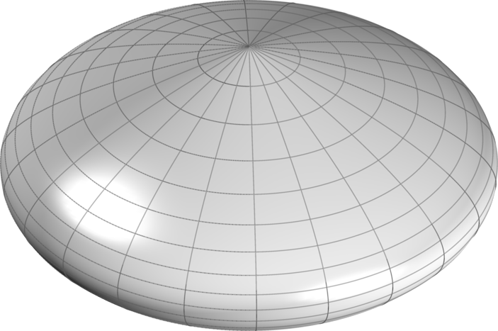

<h1 align="center">Gravity and Action from the Parabolic Metric Evolution of a Complex Manifold</h1>

  <strong>Donald Airey</strong> 
  ORCID: 0000-0002-2958-1545 
  Cooperstown, NY, USA 
  <a href="mailto:don@airey.us">don@airey.us</a>

  <em>
    cosmology · gravitational theory · cosmic expansion · cosmological dynamics ·
    Type Ia supernovae · large-scale structure
  </em>

<h2>Abstract</h2>

We present a bilocal geometric framework in which separations are defined between ordered pairs of events rather than by a local infinitesimal metric. This construction is motivated by the need to represent global evolution in a manner that remains well-defined over finite separations while admitting a smooth local limit.

The resulting geometry is formulated on a complex manifold with an imaginary temporal coordinate and a real spatial coordinate. A constant manifold acceleration sets the global spatial scale and produces a parabolic cycle of expansion and contraction.

In the local reduction, the same acceleration scale yields a circular-orbit envelope consistent with the baryonic Tully–Fisher relation. At cosmological scales, the resulting analytic distance–redshift relation predicts the Pantheon+ Type Ia supernova luminosity distances on the SH0ES-calibrated absolute scale and yields a lower covariance-weighted $\chi^2$ than Planck-calibrated FLRW, without invoking dark matter or dark energy.

The parabolic metric evolution, when combined with standard recombination microphysics, yields an acoustic angular scale consistent with Planck measurements.

  

  <em>
    Schematic representation of the complex parabolic metric manifold.
    Latitude lines correspond to spatial slices at fixed epoch,
    while longitude lines trace the temporal evolution of the manifold.
  </em>

<h2>Overview</h2>

The Parabolic Metric Evolution (PME) framework develops a kinematic description in which large-scale cosmological evolution and local gravitational phenomena arise from a common geometric structure. Instead of assigning distances only through local infinitesimal metric elements, PME defines separations bilocally between ordered pairs of events.

The framework is governed by a single acceleration scale, denoted $A$, which determines both the parabolic evolution of the manifold and the local acceleration structure associated with gravitational systems.

<h2>Bilocal Geometry</h2>

<h3>Foundational Structure</h3>

The framework is defined by the following postulates:

<ol>
  <li>Physical separations are defined bilocally between ordered pairs of events.</li>
  <li>The manifold evolution is governed by a constant acceleration scale $A$.</li>
  <li>The manifold is parameterized by an intrinsic evolution coordinate $\chi$.</li>
  <li>Observable time is defined operationally through null exchange, providing an invariant ordering of events. The intrinsic evolution parameter is related to this observable time by the projection $\chi=it$, which fixes the real–imaginary decomposition of temporal and spatial functionals and serves as a defining structural postulate of the framework.</li>
</ol>

All subsequent results follow from this structure.

<h3>Bilocal Spatial Separation</h3>

Let $p_e=(x_e^0,x_e^1)$ denote an emission event and $p_o=(x_o^0,x_o^1)$ an observation event, with the bilocal interval constructed from a temporal functional obtained from accumulated evolution between slices and a spatial functional defined from separations on the emission and observation slices.

The bilocal construction is illustrated in Figure 2. The spatial slices scale with a global manifold extent $L(t)$, so the separations at emission and observation satisfy:

$$\frac{\Delta x_e^1}{L(t_e)}=\frac{\Delta x_o^1}{L(t_o)}$$

Imposing symmetry under interchange of emission and observation together with a smooth coincidence limit motivates adopting the midpoint average as the minimal symmetric choice:

$$\Delta s^1=\Delta x_o^1-\frac12\left(\Delta x_o^1-\Delta x_e^1\right)$$

$$\Delta s^1=\frac12\left(\Delta x_o^1+\Delta x_e^1\right)$$

  

  <em>
    Geometric construction of the bilocal interval between emission event $p_e$ and observation event $p_o$, showing the accumulated temporal evolution and the symmetric midpoint spatial separation between scaled slices.
  </em>

<h3>Invariance of the Bilocal Interval</h3>

Consider a bilocal scalar constructed from the temporal and spatial endpoint functionals $(\Delta s^0,\Delta s^1)$. We adopt a quadratic form as the lowest-order scalar consistent with finite separations, ensuring that the local reduction yields a well-defined null condition while avoiding higher-order dependence on endpoint structure:

$$\Delta s^2=a(\Delta s^0)^2+b(\Delta s^1)^2+2c\,\Delta s^0\Delta s^1$$

Under interchange of the ordered endpoints $(p_e,p_o)$, the temporal functional changes sign while the symmetric spatial functional does not, so the mixed term changes sign. Invariance therefore requires $c=0$.

In the local reduction, sufficiently small endpoint separations render the temporal and spatial functionals linear in the coordinate increments. The null condition must define a finite null ratio, which requires both temporal and spatial contributions to enter non-degenerately. The interval therefore reduces to:

$$\Delta s^2=a(\Delta s^0)^2+b(\Delta s^1)^2$$

The remaining quadratic form is therefore constrained up to a positive overall factor and a relative scaling between the temporal and spatial functionals. These functionals are not arbitrary coordinates but are identified with the canonical imaginary and real components of the complex manifold, with this identification fixing their relative normalization. The bilocal interval is therefore:

$$\Delta s^2=(\Delta s^0)^2+(\Delta s^1)^2$$

with $\Delta s^0$ purely imaginary and $\Delta s^1$ real.

<h3>Imaginary Velocity</h3>

The intrinsic evolution of the manifold is parameterized by a coordinate $\chi$. Observable time is introduced by the projection $\chi=it$, so that $d\chi=i\,dt$, fixing the real–imaginary decomposition used in the bilocal construction.

With constant intrinsic acceleration $A$, the velocity scale along the manifold history follows from integration with respect to $\chi$:

$$v(t)=\int A\,d\chi$$

Substituting $d\chi=i\,dt$ gives $v(t)=i\int A\,dt$, which evaluates to:

$$v(t)=i(At-V_0)$$

where $V_0$ is an integration constant representing the initial expansion rate of the manifold.

<h3>Induced Spatial Evolution</h3>

The observable spatial extent arises from integrating the imaginary velocity along the imaginary temporal direction. The global spatial scale of the manifold is therefore $L(t)\equiv\int v(t)\,d\chi$. Substituting the expression for $v(t)$ and using $d\chi=i\,dt$ gives $L(t)=\int i(At-V_0)i\,dt$. Evaluating the integral yields:

$$L(t)=V_0t-\frac12At^2$$

<h3>Manifold Deceleration</h3>

The intrinsic evolution is defined along $\chi$, while observable dynamics are expressed in the projected time coordinate $t$ with $d\chi=i\,dt$. Rewriting the manifold extent in terms of $t$ yields its observable form. Differentiating twice with respect to $t$ gives:

$$\frac{d^2L}{dt^2}=-A$$

so the manifold extent evolves with a constant kinematic deceleration of magnitude $A$, which is universal and independent of position or epoch.

<h2>Cosmological Distance</h2>

Observable cosmological distances follow from the bilocal interval defined above.

<h3>Temporal Separation</h3>

The temporal component of the bilocal interval is obtained from the accumulated tangent evolution along the manifold history between the emission and observation parameters $t_e$ and $t_o$.

$$\Delta s^0=\int_{t_e}^{t_o}i(At-V_0)\,dt$$

Evaluating the integral gives:

$$\Delta s^0=i\left[\frac{A}{2}(t_o^2-t_e^2)-V_0(t_o-t_e)\right]$$

<h3>Spatial Separation</h3>

The symmetric midpoint construction yields:

$$\Delta s^1=\frac{\Delta x_o^1}{2}\left(1+\frac{V_0t_e-\frac12At_e^2}{V_0t_o-\frac12At_o^2}\right)$$

<h3>Bilocal Metric Formula</h3>

The interval relating emission and observation events is therefore:

$$\Delta s^2=\left[i\left(\frac{A}{2}(t_o^2-t_e^2)-V_0(t_o-t_e)\right)\right]^2+\left[\frac{\Delta x_o^1}{2}\left(1+\frac{V_0t_e-\frac12At_e^2}{V_0t_o-\frac12At_o^2}\right)\right]^2$$

<h3>Redshift Relation</h3>

Redshift is defined observationally by:

$$1+z=\frac{\lambda_o}{\lambda_e}$$

Assuming wavelengths scale with the manifold extent:

$$1+z=\frac{L(t_o)}{L(t_e)}$$

Solving the null condition for the observable spatial separation yields:

$$D_C(z)=\frac{t_o(2V_0-At_o)z}{2+z}$$
